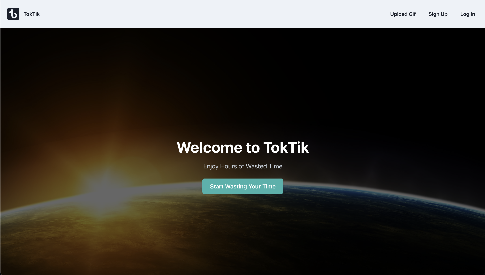
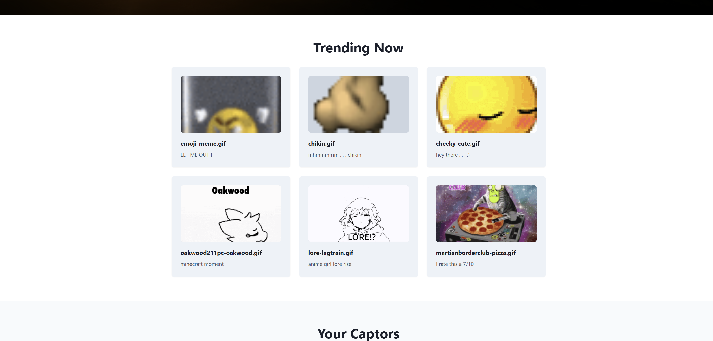
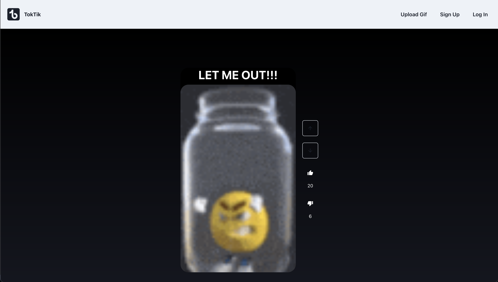
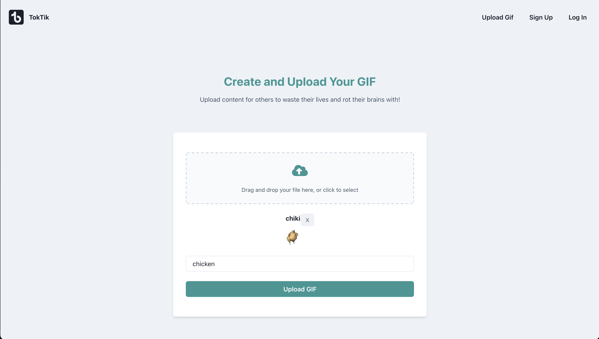
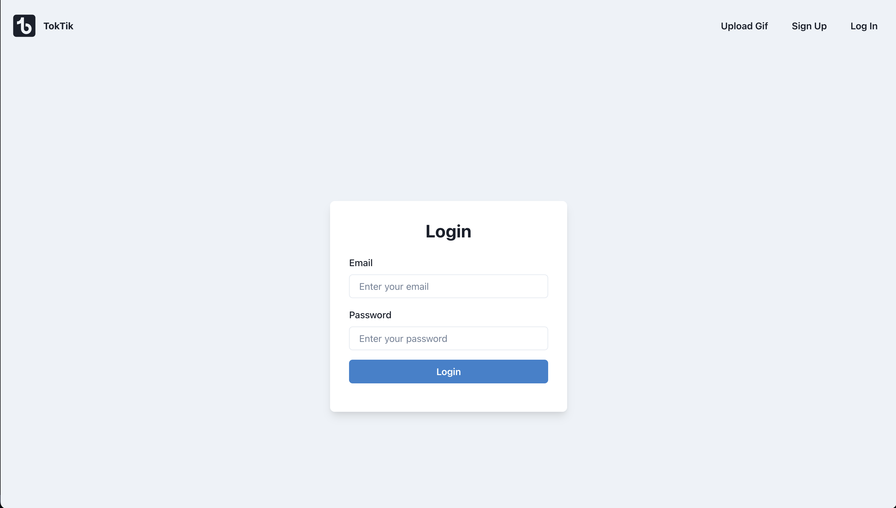
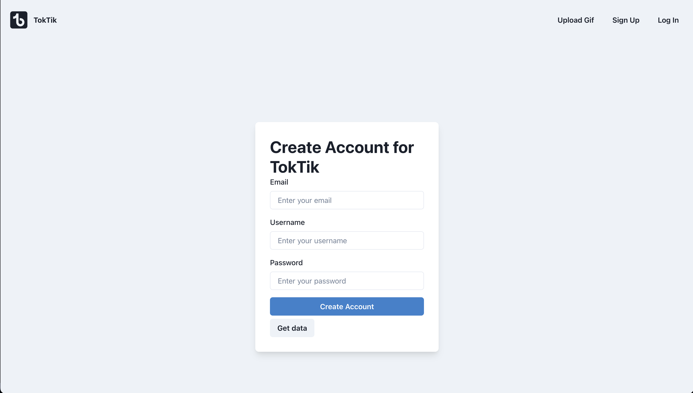

# To run TokTik

In the project directory, run the command

## `npm config set legacy-peer-deps true`

Then run

## `npm install`

and

## `npm run start`

If there are any errors with packages missing, install them.

We had an issue with `npm install ajv@latest`

# Backend Repo

There is also a backend repository that is needed for the API calls to query the hosted MongoDB database.

## https://github.com/M005A/TokTikDB

# Images

